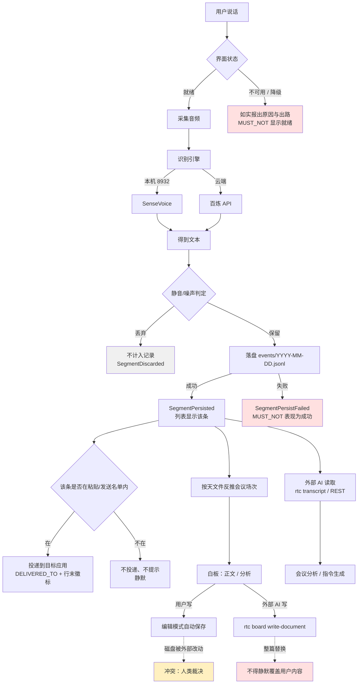
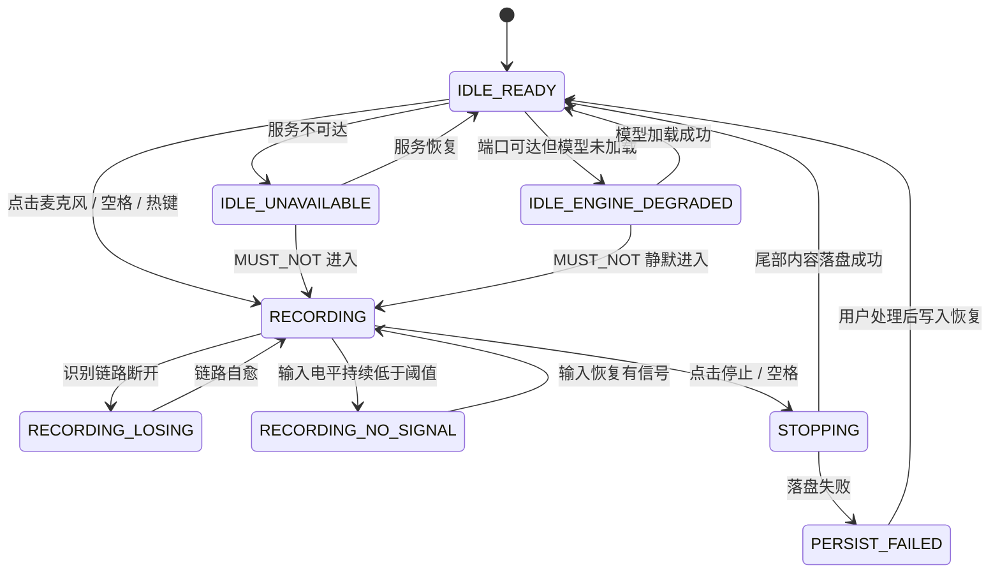
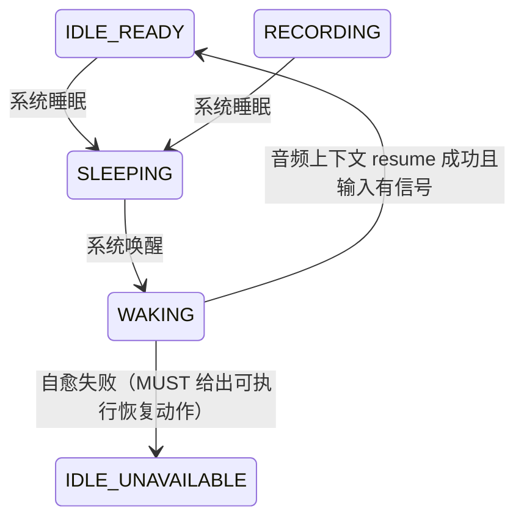
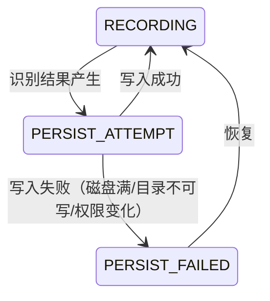
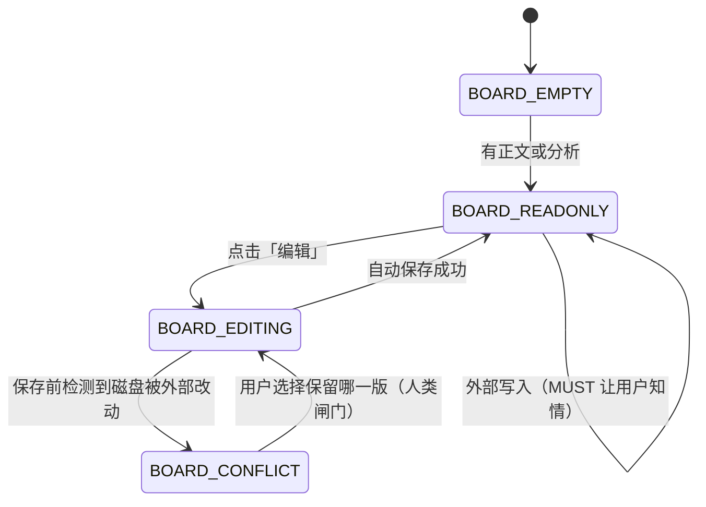
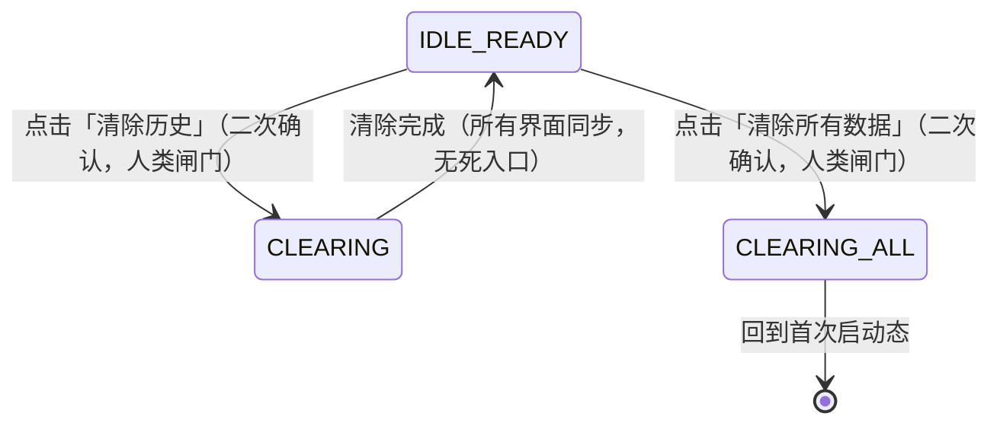

# task-graph.md —— 任务图谱（阶段⑧ 可执行规约 · 任务图谱）
# 项目：RTC 实时语音转文字 ｜ 人工重写，非生成器初稿
#
# 与 intent.yaml 的 task_graph 段一一对应；每个状态/迁移都指向一条能力问题或 claim。
# 与 ontology.yaml 的 roundtrip：状态迁移 ↔ events 声明 ↔ constraints oracle。

# ── 主流程编排图（mermaid flowchart TD）──────────────────────────────────────

# ── 子流程状态机 ─────────────────────────────────────────────────────────────
## 状态机一：录音与识别（主链路）

## 状态机二：睡眠唤醒恢复

## 状态机三：录音中落盘失败

## 状态机四：会议白板

## 状态机五：数据清除

# ── 编排规则四要素（人工逐条回答）────────────────────────────────────────────
orchestration_rules:
  - rule: parallel_fan_out
    question: "哪些可以并行扇出，哪些必须串行？"
    answer: >
      可并行：识别（8932）、模型管理（8933）、代理（8931）三者互不阻塞；
      对外展示的统计聚合、白板分析、外部 AI 读取可以并行。
      必须串行：音频采集 → 识别 → 落盘 → 投递（粘贴/发送）——后一步的事实来源是前一步，
      特别是「只有落盘成功的记录才允许投递」与「列表显示 ⟹ 已落盘」两条约束；
      白板冲突检测必须在保存之前完成，不得先写后比。
      跨实例（开发态 + 已安装应用同时运行）没有互斥机制，两条链路实际并行写同一份记录文件——
      这是 C-037 的根因，属于已知未解决缺口，不得当成串行来处理。

  - rule: independent_verifier
    question: "授权/校验是否独立成 Activity 并在每个业务副作用前重复验证？"
    answer: >
      没有独立的校验 Activity。当前实现里，可用性判定（端口可达 / 模型已加载）与副作用
      （开始录音、写入配置、安装更新）在同一个流程内，判定结果不二次复核。
      具体后果：端口可达即报「就绪」（状态诚实约束不成立）；外部 AI 与界面并发写 config 没有
      复核（配置写入不互相覆盖约束不成立）；更新安装前不检查录音是否在进行（录音不因更新中断约束不成立）。
      本项在 claims 中的对应：CLAIM.CONFIG.*、CLAIM.UPDATE.*、CLAIM.ASR.*。
      → 这是本项目 38 条 R3 声明里多条共同指向的结构性缺口。

  - rule: stop_rule
    question: "每个等待节点/超时的停止规则是什么？"
    answer: >
      等待类节点：识别服务连接（超时后进入 IDLE_UNAVAILABLE，不得静默重试到无限）、
      落盘写入（失败即进入 PERSIST_FAILED，不得吞掉异常继续显示成功）、
      唤醒恢复判定（超时即判为自愈失败，进入 IDLE_UNAVAILABLE 并给出可执行动作）。
      停止录音后等待尾部内容落盘：必须有超时，超时按落盘失败处理并告知用户。
      机器侧的停止规则见技能 A12：命中 OPEN_COUNTEREXAMPLE / FLAKY_RESULT 一律停止，不得重跑到绿。
      未定义停止规则的已知节点：白板冲突——用户不做选择时的行为没有定义（C-036 同类问题）。

  - rule: human_gate
    question: "哪些节点是人工闸门？AI/自动化是否可能绕过？"
    answer: >
      人工闸门三条（与 intent.yaml 中 human_gate: true 的三条迁移一致）：
      白板冲突裁决（BOARD_EDITING ↔ BOARD_CONFLICT）、清除历史/清除所有数据（IDLE_READY → CLEARING）。
      可能被绕过的路径（这是本项要盯的核心）：
      ① 白板：外部 AI 走 rtc board write-document 整篇替换，不经过编辑模式，不触发冲突检测——
         用户的手写内容会被静默覆盖，人类闸门形同不存在（C-019/C-020）。
      ② 清除：外部 AI 可以绕过界面的二次确认直接删记录文件（C-034/C-035 同类）。
      ③ 更新：「恢复默认」不经确认即生效，且确认框出现后取消不能中止（C-035/C-036）。
      ④ 应用更新：安装后自动重启，录音中的内容不落盘（C-033/S-225）。
      → 四条绕过路径都已有对应 claim 冻结，未修复前该闸门不得宣称有效。

# ── 任务图 ↔ 世界图 roundtrip（阶段⑨ 验证闭环）──────────────────────────────
roundtrip_checklist:
  - "每个状态机的合法/禁止迁移都有能力问题覆盖"
  - "每个事件在 events 中有声明，且状态迁移与事件同事务"
  - "每个守恒约束有 claims/ 中的 oracle"
  - "人工闸门无自动旁路"

roundtrip_detail:
  - item: 合法/禁止迁移有覆盖
    status: 部分
    note: >
      RECORDING_LOSING / RECORDING_NO_SIGNAL / PERSIST_FAILED / BOARD_CONFLICT /
      IDLE_ENGINE_DEGRADED 五个异常态都有对应 claim 冻结（CLAIM.AUDIO.*、CLAIM.ASR.*、CLAIM.REC.*、CLAIM.BOARD.*）。
      未覆盖：IDLE_ENGINE_DEGRADED → RECORDING 这条「MUST_NOT 静默进入」的禁止迁移，
      只有能力问题、没有冻结成 claim（在清单第三部分，R2）。
  - item: 事件声明与迁移同事务
    status: 否
    note: >
      ontology 中声明的 22 类事件（SegmentPersisted / SegmentPersistFailed / AudioFlowStalled /
      SystemWoke / WakeRecoveryResult / BoardConflictDetected / HistoryCleared 等）在实现里
      大多不存在为独立事件，只是分散的日志或状态变量。当前记录文件里只有 type=segment 一种行。
      → 这是 claim 兑现前必须先补的实现缺口，否则多条 oracle 无法机器检查。
  - item: 守恒约束有 oracle
    status: 是（仅对 R3 冻结项）
    note: 18 条 constraints 中，对应 R3 冻结 claim 的已配有 oracle 与 counterexample；R2 项仍在清单未冻结。
  - item: 人工闸门无自动旁路
    status: 否
    note: 见 orchestration_rules.human_gate 列出的四条绕过路径，全部成立且均已冻结为 claim。